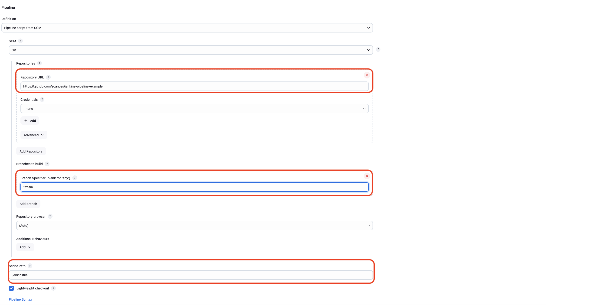
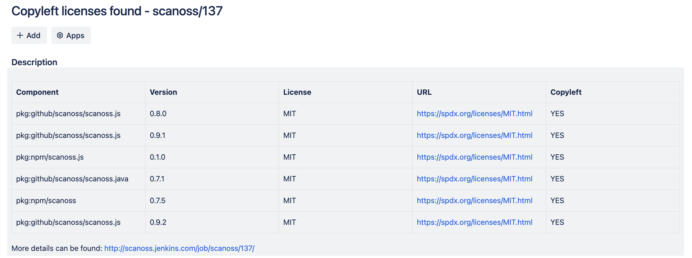

# Integrating SCANOSS with Jenkins

The following guide provides a basic setup example on how to integrate SCANOSS with Jenkins.

This repository contains an example pipeline capable of:
- Cloning a Github repository
- Scanning the source code with the [SCANOSS.PY](https://github.com/scanoss/scanoss.py) CLI
- Creating an issue in JIRA with copyleft and undeclared components information

## Use

Ensure you have all necessary pre-requisites in place and carefully follow the provided instructions.

### Pre-requisites

The following Jenkins plugins need to be installed for the full set of features in the example pipeline:

- Docker Pipeline
- Pipeline Utility Steps
- Generic Webhook Trigger
- Pipeline
- Github Plugin

## Policy Checks
The SCANOSS Jenkins integrations provides two policies:

1. ***Copyleft***: This policy checks if any component or code snippet is associated with a copyleft license. If such a
   license is detected, the pull request (PR) is rejected. The default list of Copyleft licenses is defined in the following [file](https://github.com/scanoss/ado-code-scan/blob/1218c4fe2dcda5f807b505e271096b1ec0afd8a9/codescantask/utils/license.utils.ts#L4).

2. ***Undeclared***: This policy compares the components detected in the repository against those declared in the scanoss.json
   file (customizable through the scanoss.json filepath parameter). If undeclared components are detected, the pipeline will fail.

### Instructions
1. Ensure you have Jenkins installed and configured in your environment. Refer to the official Jenkins documentation for installation instructions.

2. Open the Jenkins dashboard and create a new pipeline job.

3. Configure the pipeline job to use the provided [SCANOSS Jenkins pipeline example](SCANOSS-Jenkins-pipeline). The Jenkinsfile contains a sample pipeline script that you can customize according to your project requirements.

### Jenkins integration setup

The recommended approach to integrate SCANOSS with Jenkins is to load the pipeline from a 'Jenkinsfile' file.  To load a pipeline from a file:

1. Copy the example [`SCANOSS Jenkins pipeline example`](SCANOSS-Jenkins-pipeline) from this repository to the root of your repository.
2. Configure your Jenkins project as follows:

-   Pipeline Definition
    -   Select “Pipeline script from SCM”
        -   SCM: Git
        -   Set the following values:
            -   “Repository URL”
            -   “Credential” (for private repositories)
            -   Enter Branch to build
            -   Set script path as “Jenkinsfile”

## Jenkins Credentials

To improve security, credentials should be set in Jenkins credential store.

Navigate to Dashboard > Manage Jenkins > Credentials and select a credential store (e.g., global) and then create a new credential.

Use the same example pipeline, set the following ids:

- ***jira-credentials***: JIRA Token to report issues. Type: ***user&password***
- ***gh-token***: GitHub crendentials to access private repositories. Type: ***user&password***
- ***scanoss-token***: SCANOSS Premium subscription Key. Type: ***Secret text***
- ***dependency-track-api-key***: Dependency Track API Key. Type: ***Secret text***

# Jenkins Pipeline Configuration Guide

### Configuration Options

The following parameters are available in the example pipeline.

| Parameter                        | Description                                                                                                                                              | Default                                                                                                                                             | Type                                  |
|----------------------------------|----------------------------------------------------------------------------------------------------------------------------------------------------------|-----------------------------------------------------------------------------------------------------------------------------------------------------|---------------------------------------|
| SCANOSS_CLI_DOCKER_IMAGE         | SCANOSS CLI Docker Image.                                                                                                                                | [https://ghcr.io/scanoss/scanoss-py-jenkins:v1.30.0](https://github.com/scanoss/scanoss.py/pkgs/container/scanoss-py-jenkins/467319847?tag=v1.30.0) | Pipeline                              |
| ABORT_ON_POLICY_FAILURE          | Abort pipeline on pipeline failure.                                                                                                                      | `false`                                                                                                                                             | Pipeline                              |
| SCANOSS_API_URL                  | SCANOSS API endpoint.                                                                                                                                    | https://api.osskb.org/scan/direct                                                                                                                   | Pipeline                              |
| SCANOSS_API_TOKEN_ID             | SCANOSS API Token ID.                                                                                                                                    | scanoss-token                                                                                                                                       | Pipeline                              |
| SKIP_SNIPPET                     | Skip the generation of snippets.                                                                                                                         | `false`                                                                                                                                             | Pipeline                              |
| SCANOSS_SETTINGS                 | Settings file to use for scanning. See the SCANOSS settings [documentation](https://scanoss.readthedocs.io/projects/scanoss-py/en/latest/#settings-file) | `true`                                                                                                                                              | Pipeline                              |
| SETTINGS_FILE_PATH               | SCANOSS settings file path.                                                                                                                              | scanoss.json                                                                                                                                        | Pipeline                              |
| DEPENDENCY_ENABLED               | Scan dependencies (optional - default false).                                                                                                            | `false`                                                                                                                                             | Pipeline                              |
| DEPENDENCY_SCOPE                 | Gets development or production dependencies (scopes:  'prod' - 'dev').                                                                                   | ''                                                                                                                                                  | Pipeline                              |
| DEPENDENCY_SCOPE_INCLUDE         | Custom list of dependency scopes to be included. Provide scopes as a comma-separated list.                                                               | ''                                                                                                                                                  | Pipeline                              |
| DEPENDENCY_SCOPE_EXCLUDE         | Custom list of dependency scopes to be EXCLUDED. Provide scopes as a comma-separated list.                                                               | ''                                                                                                                                                  | Pipeline                              |
| LICENSES_COPYLEFT_INCLUDE        | List of Copyleft licenses to append to the default list. Provide licenses as a comma-separated list.                                                     | ''                                                                                                                                                  | Pipeline                              |
| LICENSES_COPYLEFT_EXCLUDE        | List of Copyleft licenses to remove from default list. Provide licenses as a comma-separated list.                                                       | ''                                                                                                                                                  | Pipeline                              |
| LICENSES_COPYLEFT_EXPLICIT       | Explicit list of Copyleft licenses to consider. Provide licenses as a comma-separated list.                                                              | ''                                                                                                                                                  | Pipeline                              |
| CREATE_JIRA_ISSUE                | Enables JIRA reporting                                                                                                                                   | `false`                                                                                                                                             | Pipeline                              |
| JIRA_URL                         | JIRA URL                                                                                                                                                 | ''                                                                                                                                                  | Pipeline                              |
| JIRA_PROJECT_KEY                 | JIRA Project Key                                                                                                                                         | ''                                                                                                                                                  | Pipeline                              |
| JIRA_CREDENTIALS                 | JIRA credentials ID                                                                                                                                      | jira-credentials                                                                                                                                    | Pipeline                              |
| DEBUG                            | Enable debugging                                                                                                                                         | Optional                                                                                                                                            | `false`                               |
| DEPENDENCY_TRACK_ENABLED         | Enable automatic upload of scan results to Dependency Track                                                                                              | Optional                                                                                                                                            | `false`                               |
| DEPENDENCY_TRACK_URL             | URL of the Dependency Track instance. Required when Dependency Track is enabled                                                                          | Required*                                                                                                                                           | -                                     |
| DEPENDENCY_TRACK_API_KEY_ID      | DEPENDENCY TRACK API key ID. Required when Dependency Track is enabled                                                                                   | Required*                                                                                                                                           | -                                     |
| DEPENDENCY_TRACK_PROJECT_ID      | UUID of an existing project in Dependency Track. Required when project name and version are not provided                                             | Required*                                                                                                                                           | -                                     |
| DEPENDENCY_TRACK_PROJECT_NAME    | Dependency track project name identifier. (will be created if it doesn't exist). Required when project ID is not provided                                | Optional                                                                                                                                            | -                                     |
| DEPENDENCY_TRACK_PROJECT_VERSION | Dependency Track project Version identifier. Required when project ID is not provided                                                                    | Optional                                                                                                                                            | -                                     |

## Setting Up GitHub Webhook Trigger

A GitHub webhook automatically triggers the pipeline whenever code is pushed to the repository. Here's how to set it up:

### 1. Configure Jenkins Pipeline

1. Navigate to **Dashboard > Select your pipeline > Configure**
2. In the Build Triggers section, select the **Generic Webhook Trigger** option
3. Copy the Jenkins webhook URL that appears

### 2. Configure Webhook Parameters

1. Under Post content parameters, add a new variable:
    - Variable name: `payload`
    - Value: `$`
    - Expression type: `JSONPath`
   
2. Set up the trigger token:
   - http://JENKINS_URL/generic-webhook-trigger/invoke?token=TOKEN

### 3. GitHub Integration

1. Configure the Jenkins webhook URL in your GitHub project settings
2. For detailed webhook setup instructions, refer to the [GitHub webhook documentation](https://docs.github.com/en/webhooks/using-webhooks/creating-webhooks)

## Pipeline Configuration Steps

### GitHub Project Settings

### Repository Configuration
Configure your GitHub repository URL in the project settings:

### Webhook Configuration
> ⚡ Important: Configure these settings carefully to ensure proper webhook functionality

#### Set up the webhook trigger in your Jenkins configuration:

#### Configure the webhook token:

#### Github webhook trigger set up:

#### Jenkins file pipeline setup:

### Private GitHub Integration (optional)
> ⚡ Important: For private GitHub repositories, it is necessary to provide user credentials. For further details, check [Github Documentation](https://docs.github.com/en/authentication/keeping-your-account-and-data-secure/managing-your-personal-access-tokens).

# Multibranch pipeline example
## Setup Instructions

### Setup Steps

1. Navigate to **Dashboard > Select 'Multibranch Pipeline' option > Configure**
2. On 'Branch Sources' section add your repository URL and credentials
3. Select your desired pipeline behaviours
4. On 'Build Configuration' section select:
- Mode: 'by Jenkinsfile'
- Script Path: 'Jenkinsfile'
5. Apply your changes and save them

#### Step 1: Pipeline Selection
From the Jenkins Dashboard, choose ***"Multibranch Pipeline"*** to create a new pipeline that will automatically manage multiple branches.

#### Step 2: Repository Configuration
Configure your repository URL and set up the necessary credentials for accessing your Git repository.

#### Step 3: Pipeline Behaviors
Select the desired pipeline behaviors such as branch discovery strategies and build triggers.

#### Step 4: Build Configuration
Set the build configuration mode to "by Jenkinsfile" and specify the script path.

# SCANOSS Policy Check Reports

## Report Generation and Storage

SCANOSS automatically generates detailed policy check reports that are:
1. Uploaded to Jenkins build artifacts
2. Integrated with JIRA (optional)

## Available Reports

### Build Artifacts
All scan results are stored as build artifacts and include:

**Default Report**
- `results.json` - Complete scan results

**Conditional Reports**
- `scanoss-copyleft-report.md` - Generated when copyleft licenses are detected
- `scanoss-undeclared-components-report.md` - Created when undeclared components are found

> **Note:** Conditional reports are only generated when their respective conditions are met during the policy check.

# Report Locations and Examples

## Jenkins Build Artifacts
Jenkins stores all SCANOSS scan reports in the run artifacts section for easy access and reference.

## JIRA Integration Reports

> ⚡ Important: JIRA issues are automatically created only when policy checks fail and JIRA integration is configured.

In order to create issues in JIRA, you must provide Jira credentials. New issues will be created in the name of the specified user.

An API Token is required to integrate JIRA. For further details, check the [JIRA Documentation](https://support.atlassian.com/atlassian-account/docs/manage-api-tokens-for-your-atlassian-account/).

### Undeclared Components Report

### Copyleft License Report

                                                                                                                         

